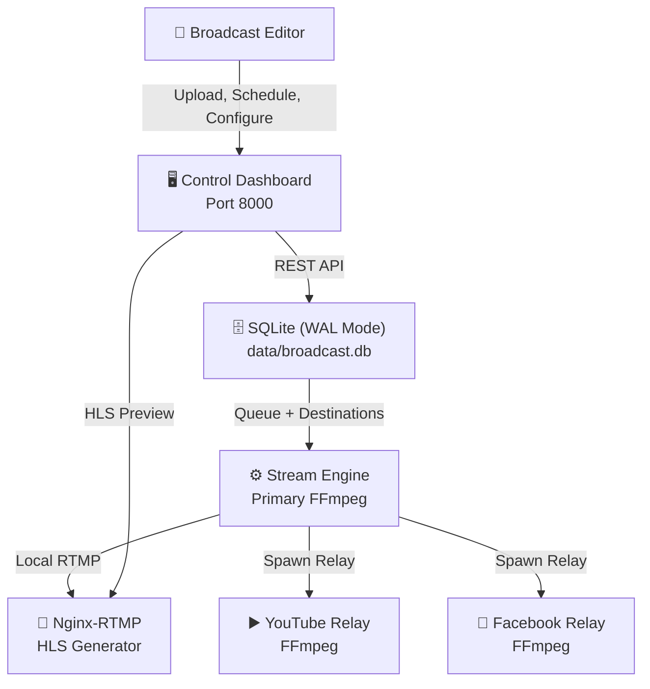

# NNS Broadcast Control System

An industrial-grade, database-driven 24×7 live streaming engine and web dashboard for YouTube, Facebook, Twitch, and other RTMP platforms.

Designed to feel and operate like a cloud-based OBS/vMix, providing a premium, zero-lag web interface for broadcasting teams.

## 🚀 Features

*   **📺 Premium Control Dashboard:** A beautiful, responsive, optimistic SPA (Single Page Application) for managing your entire broadcast. No more editing config files.
*   **♾️ Infinite Scalable Uploads:** Drag-and-drop video uploads of any size. Direct chunked saving allows for multi-GB `.mp4`, `.mkv`, `.mov` file ingests.
*   **📋 Dynamic Playlist Engine:** Build your broadcast queue visually. Set custom repeat counts, force video durations, and drag-and-drop to reorder. The stream updates dynamically between intervals without requiring a restart.
*   **🌐 Multi-Destination Streaming:** Stream directly to YouTube, Facebook, Twitch, X/Twitter, or custom RTMP servers simultaneously.
*   **🛡️ Fault-Tolerant Architecture:** The primary FFmpeg core pushes purely to a local HLS relay. Separate, auto-recovering relay processes handle external platforms. If YouTube rejects your stream key, your local broadcast and other destinations *never* go down.
*   **⚡ Zero-Lag Infrastructure:** Powered by SQLite in WAL (Write-Ahead Logging) mode and `gevent` asynchronous Python workers to guarantee the UI never freezes, even under heavy I/O loads.

## 🏗️ Architecture



## 🛠️ Quick Start

### 1. Prerequisites
- Docker & Docker Compose installed and running.

### 2. Configure Environment
```bash
cp .env.example .env
```
*(No need to set any stream keys in the `.env` file. All secrets and keys are managed securely via the web dashboard and stored in the SQLite database).*

### 3. Start the Platform
```bash
docker compose up -d --build

## License

Proprietary - All rights reserved.
